# HiddnChat Architecture

Technical architecture documentation for HiddnChat - a secure, end-to-end encrypted messaging platform.

## System Overview

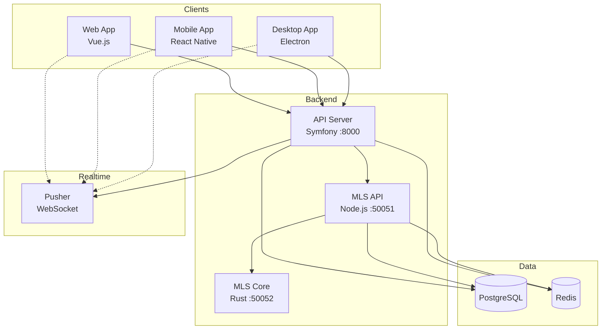

## Service Architecture

### API Server (Symfony)

Primary REST API handling authentication, conversations, and message routing.

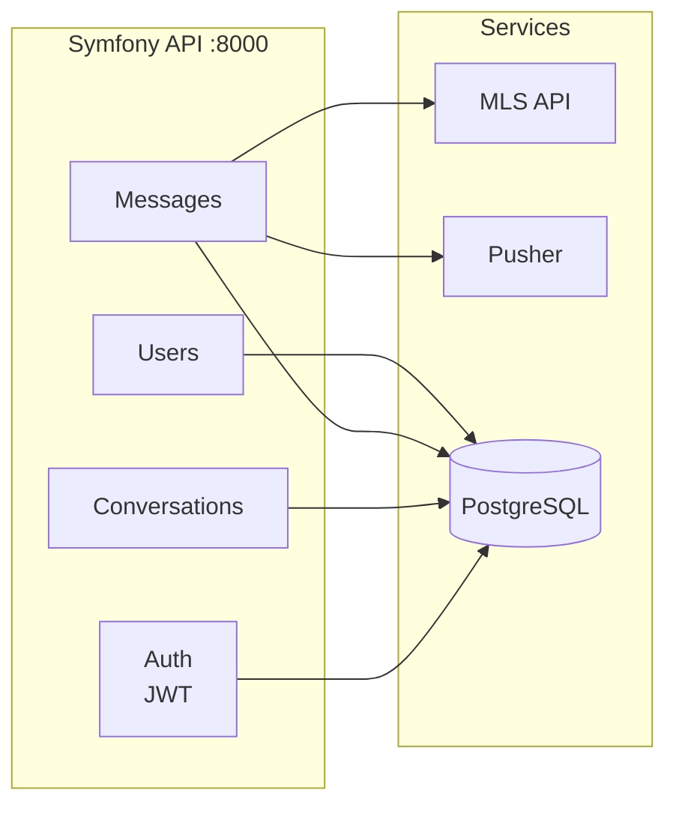

**Responsibilities:**
- User authentication (JWT)
- Conversation management
- Message storage and routing
- User presence
- Push notifications

### MLS API (Node.js)

Middleware service for MLS protocol operations.

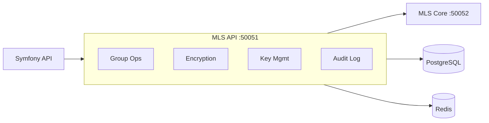

**Responsibilities:**
- Session management
- Audit logging
- Key package storage
- Rate limiting
- Caching

### MLS Core (Rust)

Core MLS protocol implementation using OpenMLS.

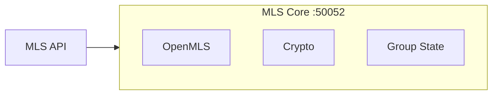

**Responsibilities:**
- RFC 9420 MLS protocol
- Key package generation
- Group creation/management
- Message encryption/decryption
- Epoch management

## Data Flow

### Message Send Flow

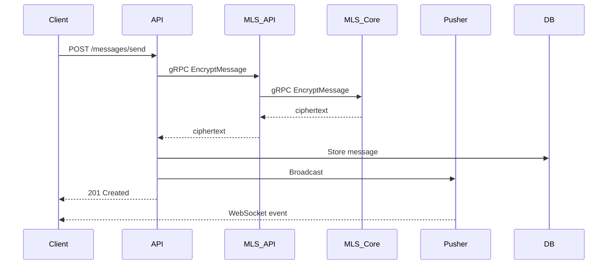

### Group Creation Flow

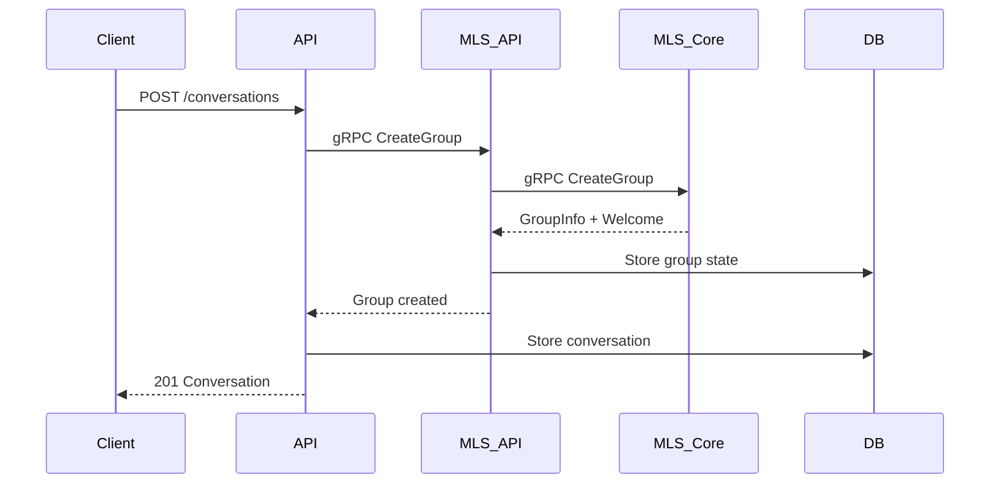

### Key Package Flow

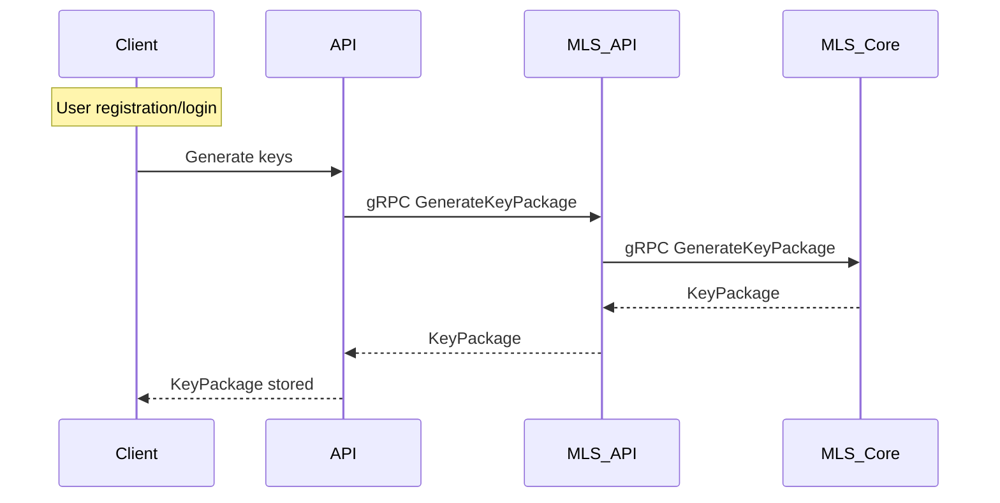

## Database Schema

### API Database (PostgreSQL)

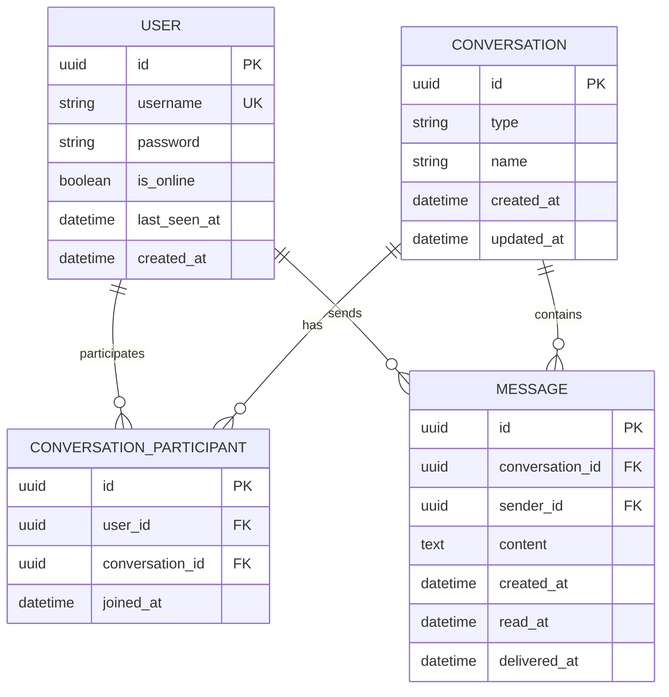

### MLS Database (PostgreSQL)

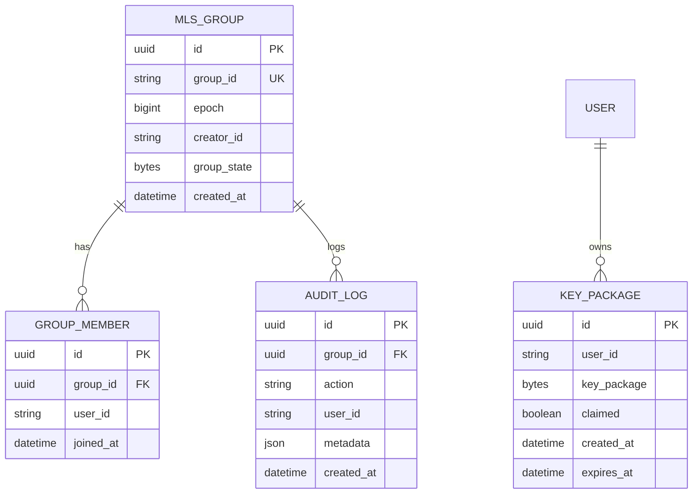

## Security Architecture

### Encryption Layers

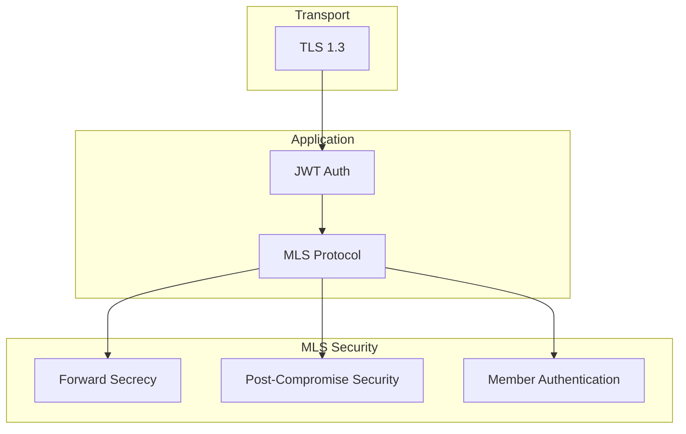

### Authentication Flow

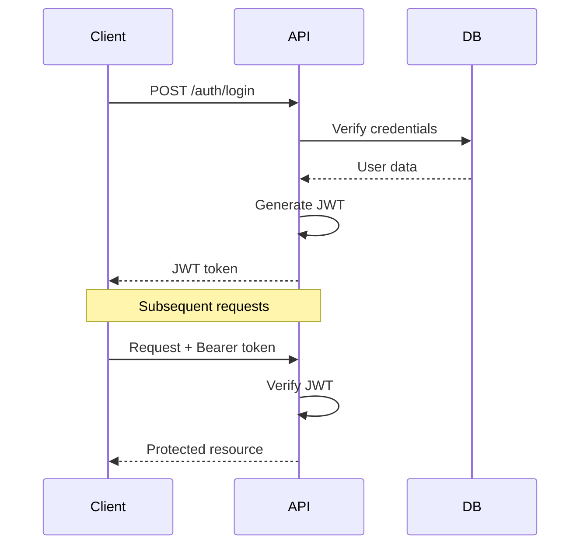

## Deployment Architecture

### Docker Compose (Development)

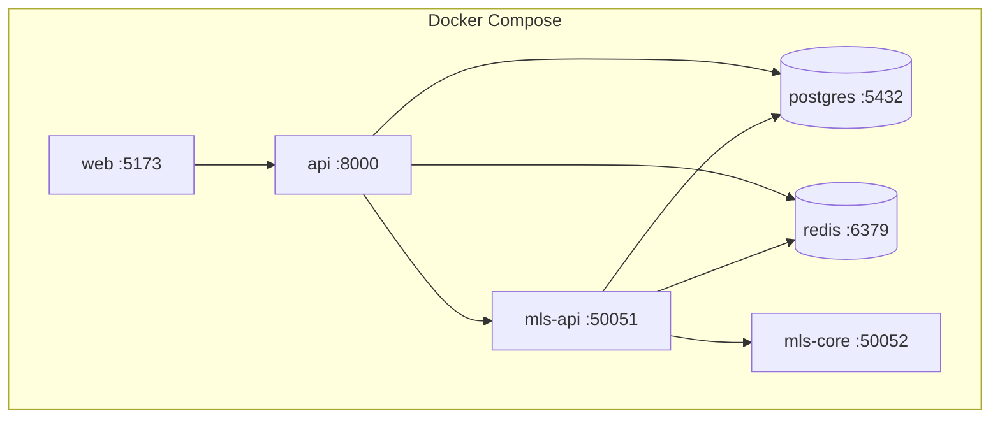

### Production

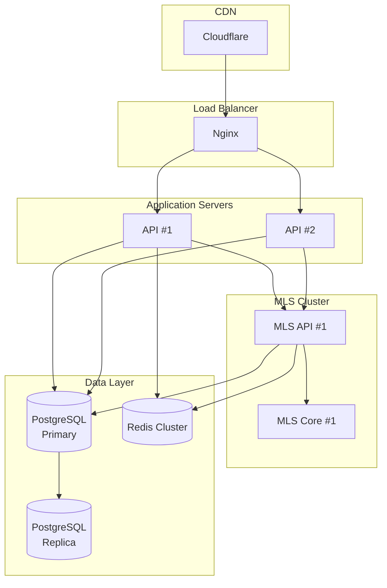

## Technology Stack

| Layer | Technology |
|-------|------------|
| Web Frontend | Vue.js 3, TypeScript, Vite |
| Mobile | React Native, Expo |
| Desktop | Electron, Vue.js |
| API | Symfony 7, PHP 8.4 |
| MLS Middleware | Node.js, gRPC |
| MLS Core | Rust, OpenMLS |
| Database | PostgreSQL 15 |
| Cache | Redis 7 |
| Realtime | Pusher |
| Auth | JWT (lexik/jwt-authentication) |

## Port Reference

| Service | Port | Protocol |
|---------|------|----------|
| API | 8000 | HTTP/REST |
| Web | 5173 | HTTP |
| MLS API | 50051 | gRPC |
| MLS Core | 50052 | gRPC |
| PostgreSQL | 5432 | PostgreSQL |
| Redis | 6379 | Redis |
