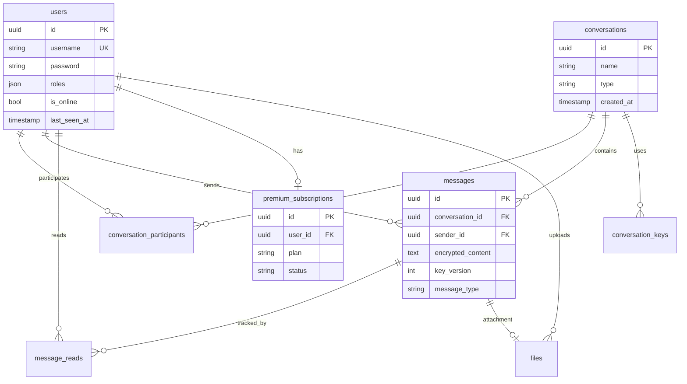

# HiddnChat Database Schema

Database schema documentation for HiddnChat.

## Overview

HiddnChat uses two PostgreSQL databases:

| Database | Service | Purpose |
|----------|---------|---------|
| `hiddn_api` | API (Symfony) | Users, conversations, messages |
| `mls_db` | MLS API (Node.js) | MLS groups, key packages, audit logs |

## API Database Schema

### users

Core user entity with authentication and subscription data.

| Column | Type | Constraints | Description |
|--------|------|-------------|-------------|
| `id` | uuid | PK | UUID v7 (time-ordered) |
| `username` | varchar(180) | UNIQUE, NOT NULL | Unique username |
| `password` | varchar | NOT NULL | Bcrypt hashed password |
| `roles` | json | NOT NULL | User roles (always includes ROLE_USER) |
| `is_online` | boolean | DEFAULT false | Online status |
| `last_seen_at` | timestamp | NULL | Last activity timestamp |
| `allow_read_receipts` | boolean | DEFAULT true | Privacy setting |
| `billing_country` | char(2) | NULL | ISO-2 country code (for VAT) |
| `billing_vat_number` | varchar(20) | NULL | EU VAT ID |
| `billing_is_b2b` | boolean | DEFAULT false | Business customer flag |
| `created_at` | timestamp | NOT NULL | Creation time |
| `updated_at` | timestamp | NOT NULL | Last update time |
| `deleted_at` | timestamp | NULL | Soft delete timestamp |

**Indexes:**
- `idx_users_username` UNIQUE on `username`
- `idx_users_is_online` on `is_online`

---

### conversations

Chat conversations (1:1 or group).

| Column | Type | Constraints | Description |
|--------|------|-------------|-------------|
| `id` | uuid | PK | UUID v7 |
| `name` | varchar(255) | NULL | Conversation name (groups only) |
| `type` | varchar(20) | NOT NULL | 'direct' or 'group' |
| `created_at` | timestamp | NOT NULL | Creation time |
| `updated_at` | timestamp | NOT NULL | Last update time |

**Indexes:**
- `idx_conversations_type` on `type`
- `idx_conversations_updated_at` on `updated_at` DESC

---

### conversation_participants

Many-to-many relationship between users and conversations.

| Column | Type | Constraints | Description |
|--------|------|-------------|-------------|
| `conversation_id` | uuid | FK, NOT NULL | Reference to conversation |
| `user_id` | uuid | FK, NOT NULL | Reference to user |

**Constraints:**
- PRIMARY KEY (`conversation_id`, `user_id`)
- FK `conversation_id` → `conversations.id` ON DELETE CASCADE
- FK `user_id` → `users.id` ON DELETE CASCADE

---

### messages

Encrypted messages with delivery tracking.

| Column | Type | Constraints | Description |
|--------|------|-------------|-------------|
| `id` | uuid | PK | UUID v7 |
| `conversation_id` | uuid | FK, NOT NULL | Reference to conversation |
| `sender_id` | uuid | FK, NOT NULL | Reference to sending user |
| `encrypted_content` | text | NOT NULL | AES-256-GCM ciphertext |
| `key_version` | integer | NOT NULL | Encryption key version |
| `message_type` | varchar(20) | NOT NULL | 'text', 'image', 'file', etc. |
| `delivered_at` | timestamp | NULL | Delivery confirmation time |
| `created_at` | timestamp | NOT NULL | Creation time |
| `updated_at` | timestamp | NOT NULL | Last update time |
| `deleted_at` | timestamp | NULL | Soft delete timestamp |

**Indexes:**
- `idx_messages_conversation_id` on `conversation_id`
- `idx_messages_sender_id` on `sender_id`
- `idx_messages_created_at` on `created_at` DESC

**Constraints:**
- FK `conversation_id` → `conversations.id` ON DELETE CASCADE
- FK `sender_id` → `users.id` ON DELETE CASCADE

---

### message_reads

Read receipt tracking per user per message.

| Column | Type | Constraints | Description |
|--------|------|-------------|-------------|
| `id` | uuid | PK | UUID v7 |
| `message_id` | uuid | FK, NOT NULL | Reference to message |
| `user_id` | uuid | FK, NOT NULL | Reference to user who read |
| `read_at` | timestamp | NOT NULL | When message was read |

**Constraints:**
- UNIQUE (`message_id`, `user_id`)
- FK `message_id` → `messages.id` ON DELETE CASCADE
- FK `user_id` → `users.id` ON DELETE CASCADE

---

### conversation_keys

Encryption keys for conversations.

| Column | Type | Constraints | Description |
|--------|------|-------------|-------------|
| `id` | uuid | PK | UUID v7 |
| `conversation_id` | uuid | FK, NOT NULL | Reference to conversation |
| `encrypted_key` | text | NOT NULL | Encrypted AES key |
| `version` | integer | NOT NULL | Key version number |
| `created_at` | timestamp | NOT NULL | Creation time |

**Constraints:**
- UNIQUE (`conversation_id`, `version`)
- FK `conversation_id` → `conversations.id` ON DELETE CASCADE

---

### premium_subscriptions

User subscription management.

| Column | Type | Constraints | Description |
|--------|------|-------------|-------------|
| `id` | uuid | PK | UUID v7 |
| `user_id` | uuid | FK, NOT NULL | Reference to user |
| `plan` | varchar(50) | NOT NULL | 'free', 'premium_monthly', 'premium_yearly' |
| `status` | varchar(20) | NOT NULL | 'active', 'cancelled', 'expired' |
| `stripe_customer_id` | varchar(255) | NULL | Stripe customer ID |
| `stripe_subscription_id` | varchar(255) | NULL | Stripe subscription ID |
| `current_period_start` | timestamp | NULL | Billing period start |
| `current_period_end` | timestamp | NULL | Billing period end |
| `created_at` | timestamp | NOT NULL | Creation time |
| `updated_at` | timestamp | NOT NULL | Last update time |

**Constraints:**
- FK `user_id` → `users.id` ON DELETE CASCADE

---

### files

File upload metadata.

| Column | Type | Constraints | Description |
|--------|------|-------------|-------------|
| `id` | uuid | PK | UUID v7 |
| `user_id` | uuid | FK, NOT NULL | Uploading user |
| `message_id` | uuid | FK, NULL | Associated message |
| `filename` | varchar(255) | NOT NULL | Original filename |
| `mime_type` | varchar(100) | NOT NULL | MIME type |
| `size` | bigint | NOT NULL | File size in bytes |
| `storage_path` | varchar(500) | NOT NULL | Storage location |
| `created_at` | timestamp | NOT NULL | Upload time |

---

### gdpr_audit_logs

GDPR compliance audit logging.

| Column | Type | Constraints | Description |
|--------|------|-------------|-------------|
| `id` | uuid | PK | UUID v7 |
| `user_id` | uuid | NULL | Affected user (NULL for system) |
| `action` | varchar(100) | NOT NULL | Action performed |
| `entity_type` | varchar(100) | NULL | Entity type affected |
| `entity_id` | uuid | NULL | Entity ID affected |
| `metadata` | json | NULL | Additional context |
| `ip_address` | varchar(45) | NULL | Client IP |
| `created_at` | timestamp | NOT NULL | Action time |

---

## MLS Database Schema

### mls_group

MLS group state storage.

| Column | Type | Constraints | Description |
|--------|------|-------------|-------------|
| `id` | uuid | PK | UUID v4 |
| `group_id` | varchar | NOT NULL, UNIQUE | MLS group identifier |
| `group_state` | blob | NOT NULL | Serialized MLS group state |
| `current_epoch` | integer | NOT NULL | Current epoch number |
| `cipher_suite` | integer | DEFAULT 1 | MLS cipher suite |
| `created_by` | varchar | NOT NULL | Creator user ID |
| `created_at` | timestamp | NOT NULL | Creation time |
| `updated_at` | timestamp | NOT NULL | Last update time |

**Indexes:**
- `idx_mls_group_group_id` UNIQUE on `group_id`

---

### mls_member

MLS group membership.

| Column | Type | Constraints | Description |
|--------|------|-------------|-------------|
| `id` | uuid | PK | UUID v4 |
| `group_id` | uuid | FK, NOT NULL | Reference to mls_group |
| `user_id` | varchar | NOT NULL | Member user ID |
| `leaf_index` | integer | NULL | MLS tree leaf index |
| `joined_at` | timestamp | NOT NULL | Join time |
| `left_at` | timestamp | NULL | Leave time |

**Constraints:**
- FK `group_id` → `mls_group.id` ON DELETE CASCADE

---

### key_packages

MLS key packages for asynchronous group joins.

| Column | Type | Constraints | Description |
|--------|------|-------------|-------------|
| `id` | uuid | PK | UUID v4 |
| `user_id` | uuid | NOT NULL | Owner user ID |
| `identity_key` | text | NOT NULL | Ed25519 public key (base64) |
| `pre_key` | text | NOT NULL | X25519 prekey (base64) |
| `pre_key_signature` | text | NOT NULL | Signature of prekey |
| `capabilities` | json | NOT NULL | Supported MLS capabilities |
| `key_package_hash` | varchar(64) | NOT NULL | Hash for lookup |
| `used` | boolean | DEFAULT false | Whether claimed |
| `used_at` | timestamp | NULL | Claim timestamp |
| `used_for_group_id` | uuid | NULL | Which group claimed it |
| `created_at` | timestamp | NOT NULL | Creation time |
| `expires_at` | timestamp | NOT NULL | Expiration time |

**Indexes:**
- `idx_key_packages_user_id` on `user_id`
- `idx_key_packages_user_used_expires` on (`user_id`, `used`, `expires_at`)
- `idx_key_packages_expires_at` on `expires_at`
- `idx_key_packages_hash` on `key_package_hash`

---

### mls_epoch_key

Epoch encryption keys (for key history).

| Column | Type | Constraints | Description |
|--------|------|-------------|-------------|
| `id` | uuid | PK | UUID v4 |
| `group_id` | uuid | FK, NOT NULL | Reference to mls_group |
| `epoch` | integer | NOT NULL | Epoch number |
| `epoch_secret_hash` | varchar(64) | NOT NULL | Hash of epoch secret |
| `created_at` | timestamp | NOT NULL | Creation time |

**Constraints:**
- UNIQUE (`group_id`, `epoch`)
- FK `group_id` → `mls_group.id` ON DELETE CASCADE

---

### user_identity_key

User long-term identity keys.

| Column | Type | Constraints | Description |
|--------|------|-------------|-------------|
| `id` | uuid | PK | UUID v4 |
| `user_id` | uuid | NOT NULL, UNIQUE | User ID |
| `identity_public_key` | text | NOT NULL | Ed25519 public key |
| `identity_private_key` | text | NOT NULL | Ed25519 private key (encrypted) |
| `key_exchange_public_key` | text | NOT NULL | X25519 public key |
| `key_exchange_private_key` | text | NOT NULL | X25519 private key (encrypted) |
| `created_at` | timestamp | NOT NULL | Creation time |
| `updated_at` | timestamp | NOT NULL | Last update time |

---

## ER Diagram



## Migrations

### API (Doctrine)

```bash
# Create migration
php bin/console doctrine:migrations:diff

# Run migrations
php bin/console doctrine:migrations:migrate

# Check status
php bin/console doctrine:migrations:status
```

### MLS API (MikroORM)

```bash
# Create migration
npx mikro-orm migration:create

# Run migrations
npx mikro-orm migration:up

# Check status
npx mikro-orm migration:list
```

## Indexes Strategy

### Query Optimization

| Query Pattern | Index |
|---------------|-------|
| List user's conversations | `conversation_participants(user_id)` |
| Get conversation messages | `messages(conversation_id, created_at DESC)` |
| Check read status | `message_reads(message_id, user_id)` |
| Get available key packages | `key_packages(user_id, used, expires_at)` |
| Find online users | `users(is_online)` |

### Soft Delete Queries

Tables with `deleted_at` should always filter:

```sql
-- Example: Get active users
SELECT * FROM users WHERE deleted_at IS NULL;

-- Example: Get non-deleted messages
SELECT * FROM messages WHERE deleted_at IS NULL;
```
